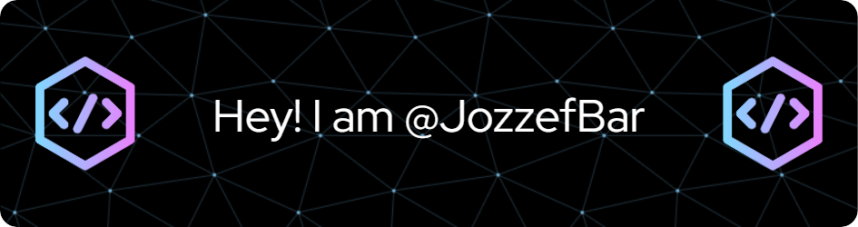

<!--
## Hi  I'm @JozzefBar &nbsp; 
-->

 -  I’m interested in sport/technology
 -  I’m currently learning various programming languages at STU FEI
 -  I’m looking to collaborate on anything new that will give me valuable experience and help me grow as a developer.
 -  How to reach me: jbarcakw@gmail.com
 -  Fun fact: Because of my passion for sports, I once sustained several injuries, including a torn ACL, MCL, a ruptured meniscus, and even a bone fragment fracture.
  (After a year of believing all these injuries had been treated, my doctor informed me that only the ACL reconstruction was performed — the other injuries were never operated on, as the MRI report had overestimated the severity of the ruptures.
  When the doctor explained it to me, I didn’t fully understand it at the time. )

---

### &nbsp; Languages and Tools 

  
  
  
  
  
  
  
  
  
  
  
  
  

---

  

  
&nbsp; Why I choose computer science?

    
When I had to choose my graduation subjects in high school, I had no idea what might interest me. I thought for a long time about what I could focus on. I knew, since I was at a grammar school, that I didn't do well in subjects that required a lot of memorization, like biology or civic education. I've always been more inclined toward logical thinking, although I never excelled in math.

    
By process of elimination, I chose computer science and mathematics. Computer science became my greatest interest when COVID hit. Since many people weren't studying, I helped my entire class with programming assignments, and that's when I learned most about programming in Python. That's when I really fell in love with programming, although my true passion has always been sports, but I wasn't lucky in that area.

    
So, I decided to pursue what I was best at in high school, and that was computer science. Now, I am studying Computer Science at Slovak University of Technology in Bratislava (STU) in Bratislava. I'm still struggling with all the math courses, but I know I can handle it. Even though I haven't graduated yet, I'm confident that I made the best decision to study IT.

    

      
    

  

<!--

  
<h3>&nbsp; Why I choose computer science?</h3>

  

    
When I had to choose my graduation subjects in high school, I had no idea what might interest me. I thought for a long time about what I could focus on. I knew, since I was at a grammar school, that I didn't do well in subjects that required a lot of memorization, like biology or civic education. I've always been more inclined toward logical thinking, although I never excelled in math.

    
   
By process of elimination, I chose computer science and mathematics. Computer science became my greatest interest when COVID hit. Since many people weren't studying, I helped my entire class with programming assignments, and that's when I learned most about programming in Python. That's when I really fell in love with programming, although my true passion has always been sports, but I wasn't lucky in that area.

    
So, I decided to pursue what I was best at in high school, and that was computer science. Now, I am studying Computer Science at Slovak University of Technology in Bratislava (STU) in Bratislava. I'm still struggling with all the math courses, but I know I can handle it. Even though I haven't graduated yet, I'm confident that I made the best decision to study IT.

  

-->
<!--

––>

